# UIAutoTest 架构与实现原理

本文档描述 UIAutoTest 项目的整体架构、核心模块职责、数据流转与运行时行为，便于新成员理解系统设计与扩展点。

---

## 1. 项目定位与设计目标

UIAutoTest 是一套 **「自然语言 / 表格 → 可执行 UI 自动化」** 的框架，目标是用尽量少的代码维护成本覆盖 Android 真机回归。

| 设计目标 | 实现方式 |
|----------|----------|
| 用例易编写 | `.nl` 自然语言文件、Excel/飞书 CSV 批量导入 |
| 用例可执行 | 自动生成 `pytest + Appium + Allure` 脚本 |
| 定位稳定 | 生成期 adb UI dump 解析 `resource-id`，运行时主定位 + fallback 链 |
| 一键运行 | 统一 CLI `uiatest.py`：依赖安装、Appium 启动、pytest、报告打开 |
| 可分发 | Skill 目录 + `scaffold/` 脚手架，他人无需克隆完整仓库 |
| 可集成 Agent | Cursor Skill（`SKILL.md`）指导 Agent 调用同一套 CLI |

**技术栈：** Python 3.10+ · pytest · allure-pytest · Appium-Python-Client · Selenium W3C · Node Appium Server · adb · Allure CLI

---

## 2. 系统上下文（System Context）

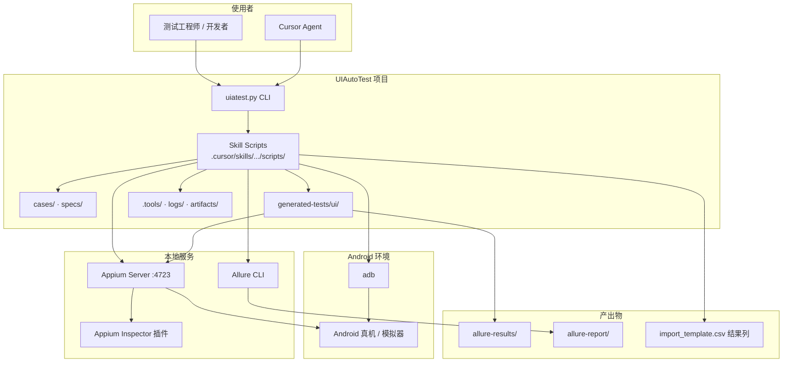

**边界说明：**

- 框架 **不负责** 被测 App 的业务逻辑，只负责驱动 UI 与断言。
- 框架 **不负责** 云端 CI 编排（可在 CI 中调用 `uiatest run`）。
- Inspector 与自动化测试 **共享** Appium Server，但通过 keepalive 暂停/恢复机制避免互相干扰。

---

## 3. 逻辑分层架构

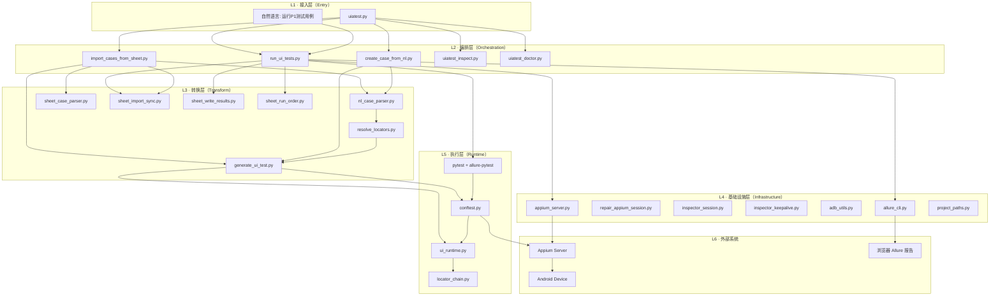

**分层职责：**

| 层 | 职责 | 特点 |
|----|------|------|
| L1 接入 | 统一命令入口、参数转发 | 薄层，无业务逻辑 |
| L2 编排 | 串联「同步→启动→执行→报告→回写」 | 流程控制中心 |
| L3 转换 | NL/表格 → JSON Spec → Python 测试 | 纯逻辑 + 文件 I/O |
| L4 基础设施 | Appium/adb/Allure/Inspector 生命周期 | 可独立调用 |
| L5 执行 | pytest fixture + 步骤引擎 | 在设备上真正操作 UI |
| L6 外部 | Appium、adb、浏览器 | 不在仓库内 |

---

## 4. 目录结构与 artifact 关系

```text
UIAutoTest/
├── uiatest.py                          # 统一 CLI 入口
├── cases/                              # 【编写层】用例源
│   ├── *.nl                            #   自然语言单条用例
│   └── import_template.csv             #   表格批量用例 + 测试结果列
├── specs/P0~P4/                        # 【规格层】JSON 中间表示
│   └── {test_name}.json
├── generated-tests/ui/                 # 【执行层】生成的 pytest
│   ├── conftest.py                     #   共享 driver fixture
│   ├── _lib/
│   │   ├── ui_runtime.py               #   步骤执行引擎
│   │   └── locator_chain.py            #   定位器链
│   ├── pytest.ini / requirements.txt
│   └── P0~P4/test_{test_name}.py
├── allure-results/{name}/              # 【报告层】pytest 原始 JSON
├── allure-report/{name}/               # 【报告层】HTML 静态站点
├── capabilities.template.json          # 提交到 Git 的模板
├── capabilities.local.json             # 本地覆盖（gitignore）
├── .tools/                             # Allure CLI、JRE、sync 状态、junit 临时文件
├── logs/                               # appium-server.log、inspector-keepalive.log
├── .appium-inspector-session.json      # Inspector 会话元数据（gitignore）
└── .cursor/skills/ui-auto-pytest-allure/
    ├── SKILL.md                        # Agent 行为指南
    ├── DISTRIBUTION.md                 # 仅 Skill 分发说明
    ├── scaffold/                       # init 时复制到项目根的模板
    └── scripts/                        # 全部 Python 实现
```

**Artifact 依赖链：**

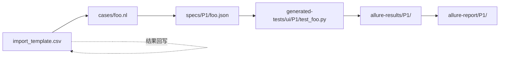

同一用例在三个层次各有一份表示：

| 层次 | 文件 | 面向谁 |
|------|------|--------|
| 编写 | `.nl` / CSV 行 | 测试工程师 |
| 规格 | `specs/.../*.json` | 工具链、版本 diff |
| 执行 | `test_*.py` | pytest 运行时 |

**约定：** 不要直接 `python test_*.py`，必须通过 `pytest` 或 `uiatest run`，以便加载 `conftest.py` 中的 Appium fixture。

---

## 5. 用例生命周期（从编写到报告）

### 5.1 总览流程

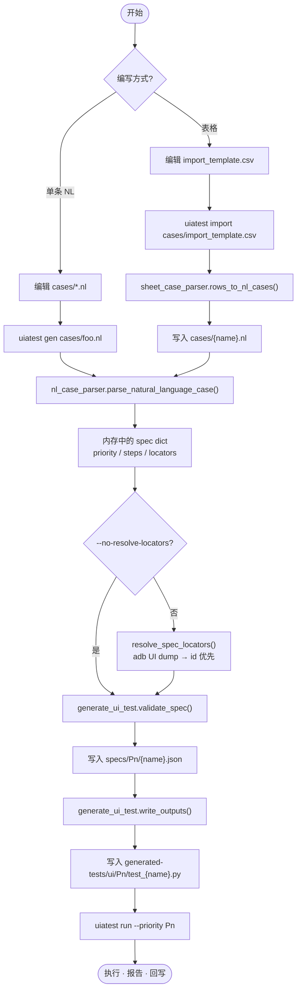

### 5.2 自然语言解析原理（`nl_case_parser.py`）

输入示例：

```text
P1
用例名: setting_map
标题: 设置-地图-setting_map
功能: 设置
模块: 地图

步骤1: 点击 id:com.xxx:id/btnSettings
步骤2: 点击 地图设置
步骤3: 设置开关 id:com.xxx:id/map_switch 关闭
```

解析过程：

1. **元数据行** — 识别 `P0~P4`、`用例名:`、`标题:`、`功能:`、`模块:`。
2. **步骤行** — `parse_step_line()` 用正则匹配动词：
   - `点击/click` → `action: tap`
   - `输入` → `action: input`
   - `设置开关` → `action: set_switch`
   - `断言` / `等待` / `循环` / `截图` / `滑动` 等
3. **定位器** — `parse_locator()`：
   - 显式前缀：`id:`、`xpath:`、`accessibility:`、`uiautomator:`、坐标
   - 纯文本 → 默认 `android_uiautomator` + `text("...")`
4. **步骤内期望** — `parse_step_expectations()` 解析后缀：
   - `，期望出现 电机锁` → `expect_visible`
   - `，期望开关 关闭` → `expect_switch`
   - `，期望开关切换` → `expect_switch_toggle`

输出为 **JSON Spec**（内存 dict），结构示意：

```json
{
  "priority": "P1",
  "test_name": "setting_map",
  "title": "设置-地图-setting_map",
  "feature": "设置",
  "story": "地图",
  "steps": [
    {
      "action": "tap",
      "locator": { "id": "..." },
      "locators_fallback": [...],
      "expect_visible": { ... }
    }
  ]
}
```

### 5.3 表格导入原理（`sheet_case_parser.py`）

CSV/XLSX 表头通过别名映射（支持中英文）：

| 逻辑字段 | 可识别列名 |
|----------|------------|
| priority | 用例等级、priority、P级 |
| name | 用例名、test_name |
| feature | 功能模块、feature |
| story | 子模块、story |
| steps | 操作步骤、steps |
| expected | 预期结果、test_result |
| result | 测试结果（仅回写，不参与 import 指纹） |

**关键设计：** 「预期结果」列与「操作步骤」**逐行对齐**。导入时会把预期行合并进步骤后缀（如 `，期望出现 X`），再交给 NL 解析器，从而生成每步的 `expect_*` 字段。

### 5.4 定位器增强（`resolve_locators.py`）

生成阶段（非运行阶段）可选执行：

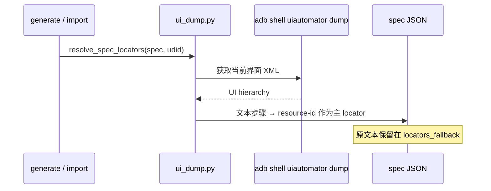

**运行时**不再 dump，只按 Spec 中已确定的 locator 链尝试。

### 5.5 代码生成（`generate_ui_test.py`）

`write_outputs(spec, output_dir)` 做三件事：

1. `validate_spec()` — 校验 action、locator 类型合法
2. 写入 `specs/Pn/{test_name}.json`
3. `build_test_file()` — 生成 Python 文件，内嵌 `STEPS = [...]` 字面量

生成的测试文件结构固定：

```python
@allure.feature(...)
@pytest.mark.P1
def test_setting_map(driver):
    run_steps(driver, STEPS, DEFAULT_TIMEOUT)
```

所有业务步骤数据在 **STEPS 常量** 中，运行时由共享的 `ui_runtime.run_steps()` 解释执行。

---

## 6. 测试运行编排（`run_ui_tests.py`）

### 6.1 运行主流程

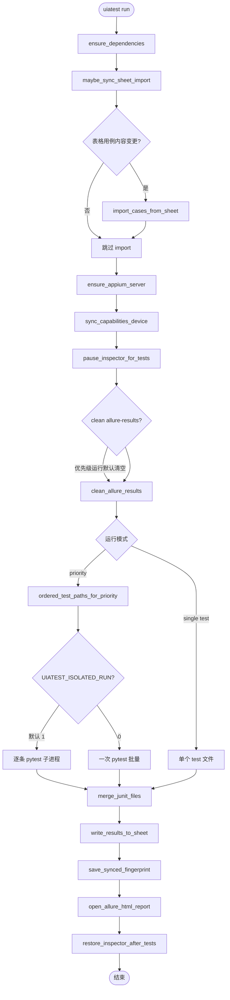

### 6.2 自然语言命令解析

`run_ui_tests.py` 支持多种触发方式：

| 输入形式 | 解析结果 |
|----------|----------|
| `运行P1测试用例` / `执行P1用例` | `mode=priority, target=P1` |
| `运行test_foo.py` / `运行 test_foo` | `mode=test, target=test_foo.py` |
| `连接设备 192.168.1.1:5555 并运行P1测试用例` | 先 adb connect，再跑 P1 |
| `--priority P1` / `--test foo.py` | CLI 直传 |

设备连接与入口 Activity 覆盖：

- `--device` → `appium_server.connect_device()` + 写入 `capabilities.local.json`
- `--start-package` / `--start-activity` → 覆盖 app 入口

### 6.3 隔离运行（Isolated Run）

**默认行为（`UIATEST_ISOLATED_RUN=1`）：** 按优先级跑多条用例时，**每条用例单独启动一个 pytest 进程**。

原因：Appium session 在多条用例间共享时，前一条用例留下的 Activity/弹窗会导致后一条失败（例如 password 用例停在 SettingActivity，map 用例找不到首页按钮）。

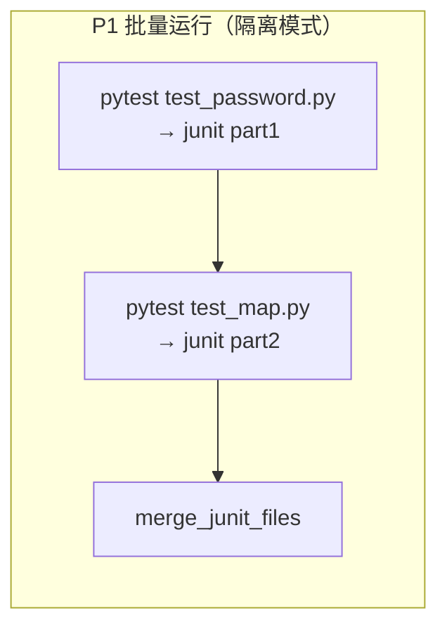

### 6.4 表格同步与结果回写

#### 自动 import 指纹（`sheet_import_sync.py`）

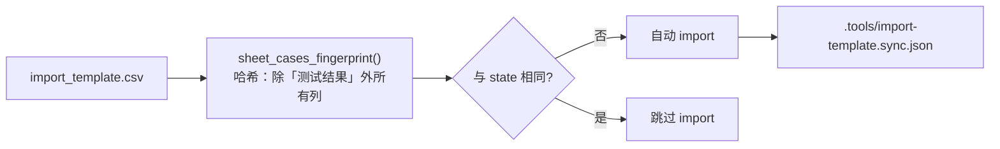

**设计意图：** 跑完用例后 CSV 的「测试结果」列会更新，若用整文件 SHA256 会导致下次运行误判「表格变更」而重复 import。因此指纹 **刻意排除结果列**。

#### 执行顺序（`sheet_run_order.py`）

优先级批量运行时，pytest 文件顺序 = CSV 中该优先级的 **行顺序**，而非文件名字母序。

#### 结果回写（`sheet_write_results.py`）

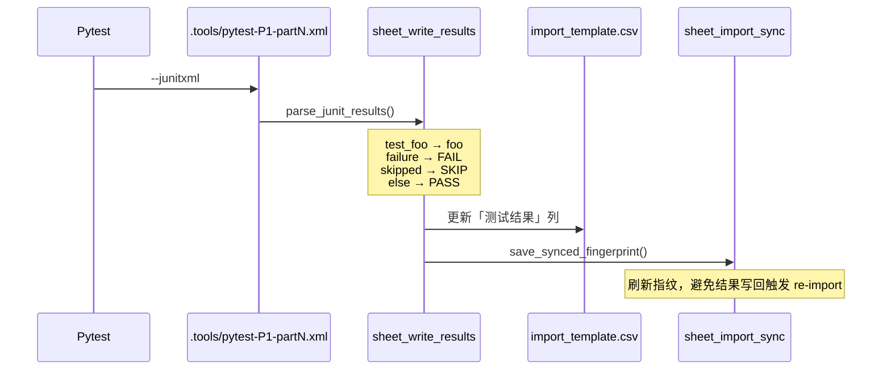

---

## 7. 运行时执行引擎

### 7.1 pytest Fixture 链（`conftest.py`）

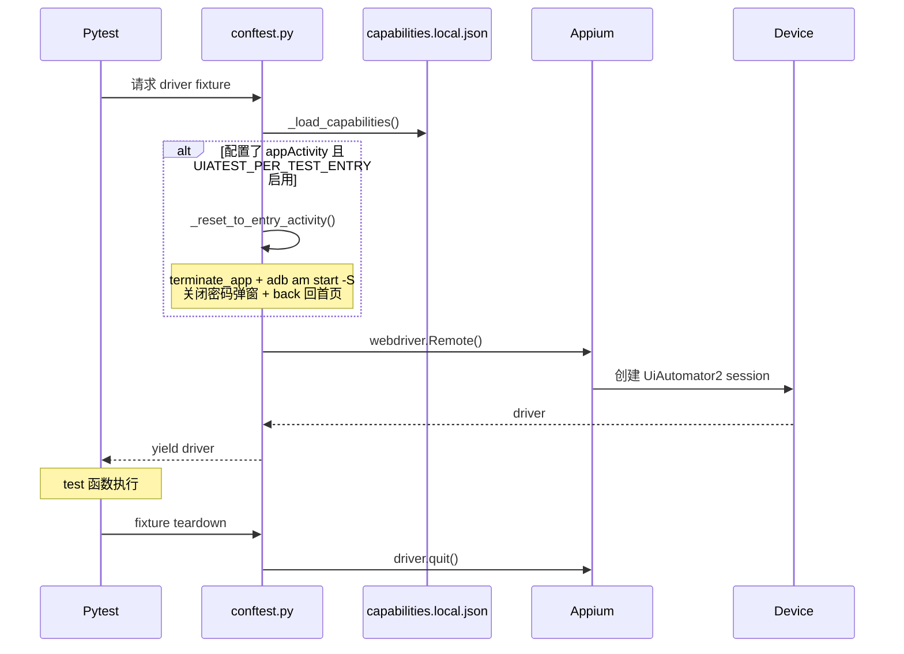

**Capabilities 加载优先级：**

1. 环境变量 `APPIUM_CAPABILITIES`（JSON 字符串）
2. 环境变量 `APPIUM_CAPABILITIES_FILE`
3. `capabilities.local.json`（本地，gitignore）
4. `capabilities.json`（legacy）
5. `capabilities.template.json`（仓库模板）

**Per-test 入口重置：** 当 `appium:appActivity` 已配置且未设置 `--no-per-test-entry` 时，每条用例开始前：

1. `driver.terminate_app()` 结束被测 App
2. `adb shell am start -S` 冷启动到入口 Activity
3. 尝试关闭密码/锁屏 overlay
4. 必要时 `back` 回到首页

这保证了批量用例之间的 **界面状态隔离**。

### 7.2 步骤引擎（`ui_runtime.py`）

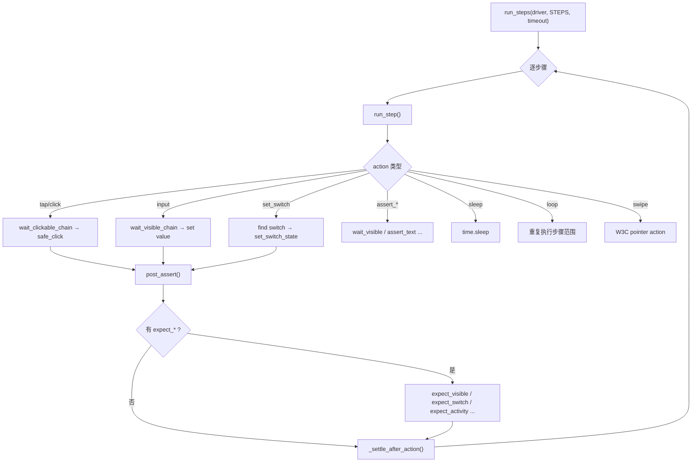

**Tap 跳过优化（`UIATEST_TAP_SKIP_IF_VISIBLE=1`，批量默认开启）：**  
若步骤已配置 `expect_visible`，且目标控件已经可见，则 **跳过点击**。用于「上一条用例已停在设置页，下一条用例第一步是点设置」的场景。

### 7.3 定位器链（`locator_chain.py`）

每个步骤可携带：

| 字段 | 含义 |
|------|------|
| `locator` | 主定位器 |
| `locators_fallback` | 备用定位器列表（按序尝试） |
| `expect_visible` | 步骤后的可见性断言主定位 |
| `expect_visible_locators_fallback` | 断言备用链 |

`step_locators(step)` 还会做 **启发式补充**（如 `tvSettings` 自动加 `btnSettings` fallback）。

运行时超时在 **整条链** 上共享预算：`wait_clickable_chain()` 依次尝试，单条失败不立即抛错，直到总超时。

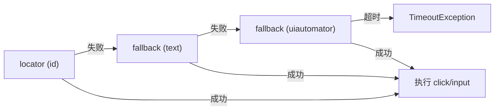

### 7.4 失败诊断（Allure 附件）

`pytest_runtest_makereport` hook 在 **call 阶段失败** 时自动附加：

| 附件 | 来源 |
|------|------|
| screenshot.png | `driver.get_screenshot_as_png()` |
| page_source.xml | `driver.page_source` |
| current_activity.txt | `driver.current_activity` |
| logcat.txt | `adb logcat -d` |
| appium-server.log | 读取 `logs/appium-server.log` 尾部 |
| screenrecord.mp4 | 可选（`UIATEST_SCREENRECORD_ON_FAIL=1`） |

---

## 8. Appium 与 Inspector 子系统

### 8.1 组件关系

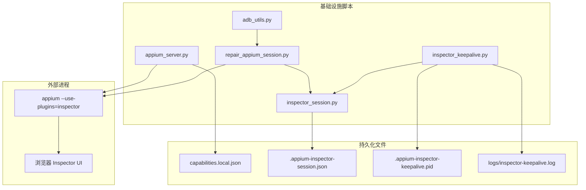

### 8.2 Appium 自动启动（`appium_server.py`）

`ensure_appium_server()` 逻辑：

1. 探测 `http://127.0.0.1:4723/status` 是否 ready
2. 未就绪则启动子进程：`appium --use-plugins=inspector --allow-insecure=*:session_discovery`
3. 日志写入 `logs/appium-server.log`
4. `sync_capabilities_device()` — 若无 `capabilities.local.json`，从 template 复制并写入当前 adb 设备 id

### 8.3 Inspector 长连接保活

**问题：** Appium Inspector 需要已有 session 才能 Attach；session 空闲超时会被销毁，导致 Refresh 失效。

**方案：**

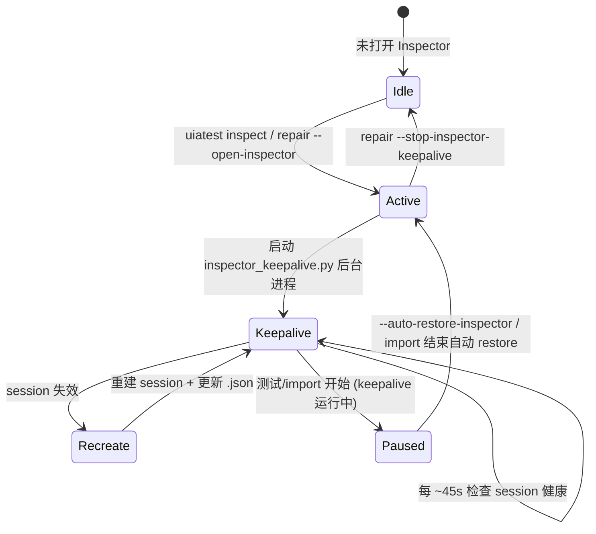

**测试运行时的 Inspector 策略（`pause_inspector_for_tests`）：**

- **仅当** keepalive 正在运行时才暂停（不会因为 `.appium-inspector-session.json` 存在就误杀）
- 停止 keepalive 进程
- 只删除 **Inspector 专用 session id**，不影响其他 Appium session
- 设置 `UIATEST_INSPECTOR_WAS_ACTIVE=1`，供跑完后 restore 判断

### 8.4 adb 工具层（`adb_utils.py`）

- `resolve_adb()` — 从 PATH 解析 adb，不硬编码路径
- `list_authorized_devices()` — 仅 `device` 状态
- `force_stop_packages()` — 修复 UiAutomator2 时强杀相关包
- 所有 adb 调用统一走 `_adb_command()`，尊重 `ANDROID_SERIAL` 与 capabilities 中的 udid

---

## 9. Allure 报告流水线

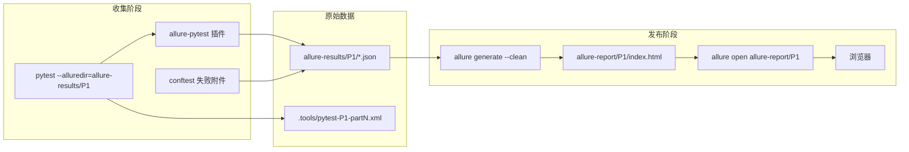

**重要约定：**

- `allure-results/` 存的是 **JSON 原始结果**，不能直接 `file://` 打开
- 必须 `allure generate` 到 `allure-report/`，再 `allure open`
- 优先级运行 **默认清空** `allure-results/P1/`（可用 `UIATEST_NO_FRESH_RESULTS=1` 关闭）
- 单条用例运行默认 **累积** 结果到 `allure-results/single/`

Allure CLI 解析顺序（`allure_cli.py`）：

1. 系统 PATH 中的 `allure`
2. 项目 `.tools/allure-2.x.x/bin/allure`（`install_allure_cli.py` 安装）
3. 可选自动安装到 `.tools/` 并写入用户 PATH（`allure-env.ps1`）

---

## 10. 统一 CLI 设计（`uiatest.py`）

`uiatest.py` 是 **纯转发层**，所有子命令映射到 skill scripts：

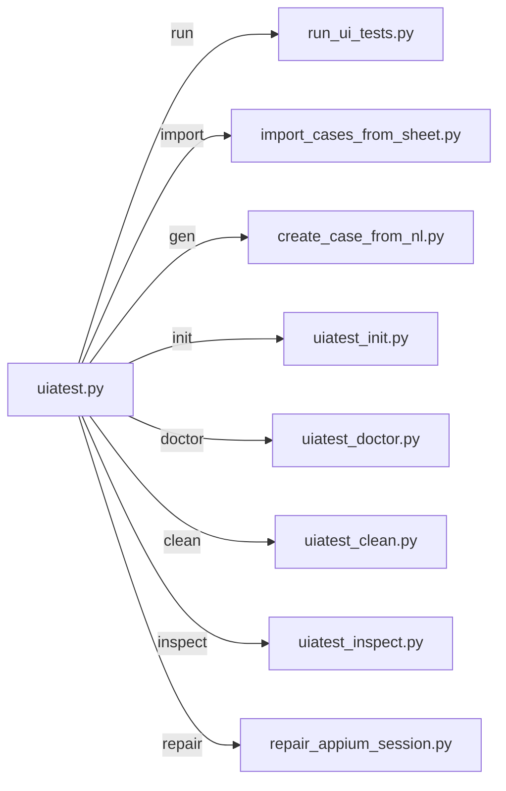

**项目根解析（`project_paths.resolve_project_root`）：** 从当前目录向上查找，命中以下任一即定为 root：

- 同时存在 `cases/` + `generated-tests/`
- 存在 `uiatest.py` + skill 目录
- 存在 capabilities 文件
- 存在 skill 的 `SKILL.md`

这允许从任意子目录调用脚本，只要 cwd 在项目树内。

---

## 11. Skill 分发架构

框架支持 **只复制 Skill 文件夹** 给他人的轻量分发模式：

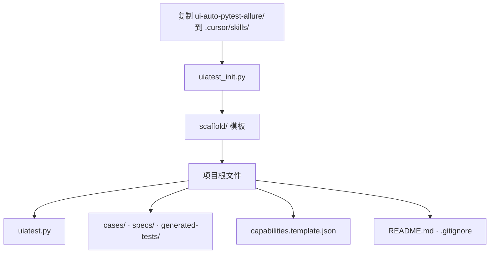

| 组件 | 提交到 Git? | 说明 |
|------|-------------|------|
| `.cursor/skills/.../scripts/` | 是（在 skill 包内） | 全部实现逻辑 |
| `scaffold/` | 是 | init 复制源 |
| `capabilities.local.json` | 否 | 设备/包名等本地配置 |
| `.tools/` | 否 | Allure/JRE 本地下载 |
| `allure-results/` / `allure-report/` | 否 | 测试产出 |
| `.appium-inspector-session.json` | 否 | Inspector 状态 |

`doctor` 会检查 scaffold 与根目录 `uiatest.py` 是否同步，避免分发版本漂移。

---

## 12. Cursor Agent 集成

Agent 通过 `.cursor/skills/ui-auto-pytest-allure/SKILL.md` 获取行为约束：


Skill 规定的核心原则：

- 用户说「运行 Px / 运行 test_xxx」→ 必须调用 `uiatest run`，禁止 `python test_*.py`
- 生成用例 → `uiatest gen` 或 `uiatest import`
- 打开 Inspector → `uiatest inspect`
- 报告由 runner 自动 `generate + open`，不是 `allure serve allure-results/`

---

## 13. 关键环境变量速查

### 执行与入口

| 变量 | 默认值 | 作用 |
|------|--------|------|
| `UIATEST_PER_TEST_ENTRY` | 有 appActivity 时启用 | 每条用例前重置到入口页 |
| `UIATEST_TAP_SKIP_IF_VISIBLE` | 批量默认 1 | 目标已可见则跳过 tap |
| `UIATEST_ISOLATED_RUN` | 1 | 优先级批量时每用例独立 pytest |
| `UIATEST_STEP_SETTLE_SEC` | 0.5 | 步骤后等待秒数 |
| `UIATEST_POST_ASSERT_TIMEOUT` | 8 | 步骤内断言超时上限 |

### 表格

| 变量 | 作用 |
|------|------|
| `UIATEST_IMPORT_SHEET` | 自定义导入表格路径 |
| `UIATEST_SKIP_SHEET_SYNC` | 禁用跑前自动 import |
| `UIATEST_SKIP_SHEET_REWRITE` | 禁用同步时 CSV 步骤编号回写 |
| `UIATEST_SKIP_SHEET_RESULTS` | 禁用跑后结果写回 CSV |

### Inspector

| 变量 | 作用 |
|------|------|
| `UIATEST_AUTO_RESTORE_INSPECTOR` | 跑完后自动 restore Inspector |
| `UIATEST_SKIP_INSPECTOR_RESTORE` | 禁止 restore |
| `UIATEST_INSPECTOR_KEEPALIVE_SEC` | 保活轮询间隔（默认 45） |
| `UIATEST_INSPECTOR_COMMAND_TIMEOUT` | Inspector session 超时（默认 86400） |

### Allure

| 变量 | 作用 |
|------|------|
| `UIATEST_NO_FRESH_RESULTS` | 优先级运行不清空 allure-results |
| `UIATEST_ALLURE_STATIC` | 打印静态报告路径 |
| `UIATEST_SCREENRECORD_ON_FAIL` | 失败时录屏 |

### Appium

| 变量 | 作用 |
|------|------|
| `APPIUM_SERVER_URL` | Appium 地址（默认 localhost:4723） |
| `APPIUM_CAPABILITIES` | 内联 JSON capabilities |
| `APPIUM_SKIP_U2_REPAIR` | 跳过 UiAutomator2 修复 |
| `ANDROID_SERIAL` | 指定 adb 设备 |

---

## 14. 扩展指南

### 14.1 新增步骤动作

1. 在 `nl_case_parser.py` 增加正则与 `parse_step_line` 分支
2. 在 `generate_ui_test.py` 的 `SUPPORTED_ACTIONS` 注册
3. 在 `ui_runtime.py` 的 `run_step()` 实现执行逻辑
4. 更新 `reference.md` / `SKILL.md` 文档

### 14.2 新增表格列

1. 在 `sheet_case_parser.py` 的 `COLUMN_ALIASES` 添加映射
2. 在 `row_to_nl_text()` 或专用转换函数中消费该列
3. 若参与 import 指纹，确认是否应纳入 `sheet_cases_fingerprint()`

### 14.3 新增 CLI 子命令

1. 在 `scripts/` 实现脚本
2. 在 `uiatest.py` 添加 subparser 与 `_run()` 转发
3. 同步 `scaffold/uiatest.py`
4. 更新 `SKILL.md` 与 `doctor` 检查项（如需要）

---

## 15. 典型端到端时序（运行 P1）

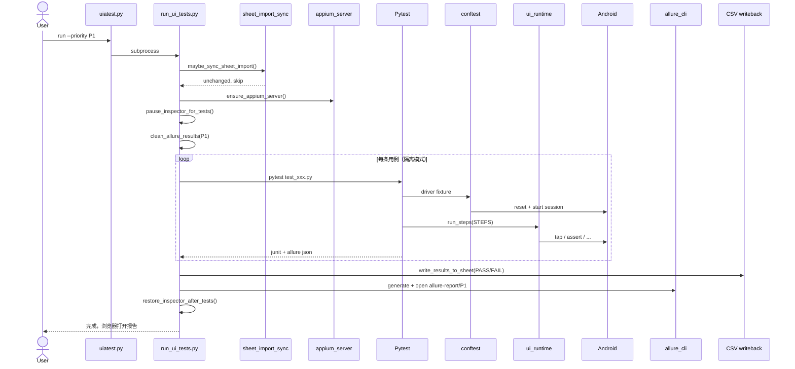

---

## 16. 相关文档索引

| 文档 | 内容 |
|------|------|
| [README.md](../README.md) | 快速开始、目录概览 |
| [MANUAL_USAGE.md](MANUAL_USAGE.md) | 无 Agent 手动 CLI 全流程 |
| [CASE_IMPORT.md](CASE_IMPORT.md) | 表格导入、同步、回写细节 |
| [SKILL.md](../.cursor/skills/ui-auto-pytest-allure/SKILL.md) | Agent 行为指南 |
| [reference.md](../.cursor/skills/ui-auto-pytest-allure/reference.md) | NL 语法与 API 参考 |
| [DISTRIBUTION.md](../.cursor/skills/ui-auto-pytest-allure/DISTRIBUTION.md) | Skill-only 分发 |
| [examples.md](../.cursor/skills/ui-auto-pytest-allure/examples.md) | 示例命令 |

---

*文档版本：与 main 分支 `c40ee64` 同期架构。若 CLI 或模块有变更，请同步更新本文档中的流程图与变量表。*
